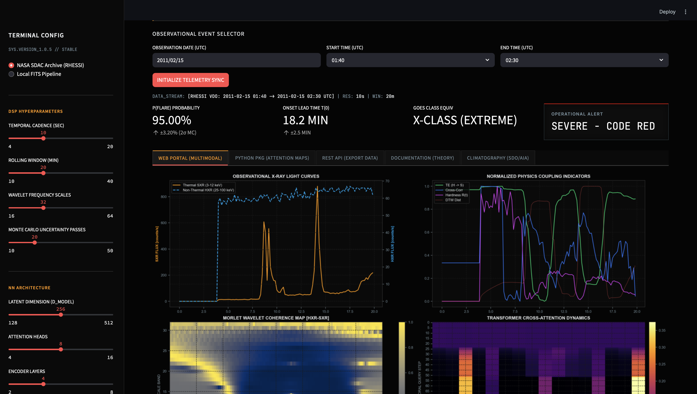
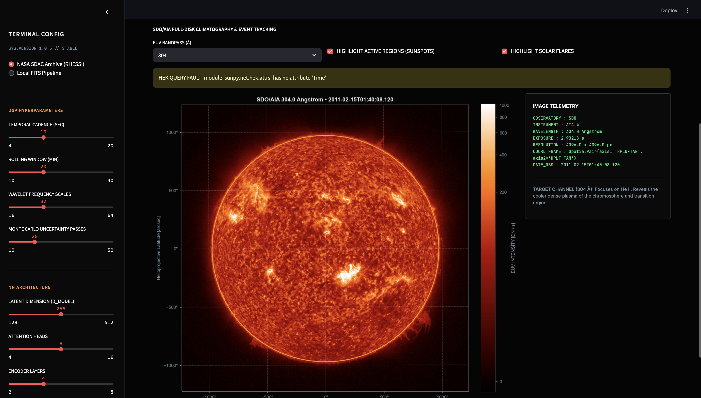
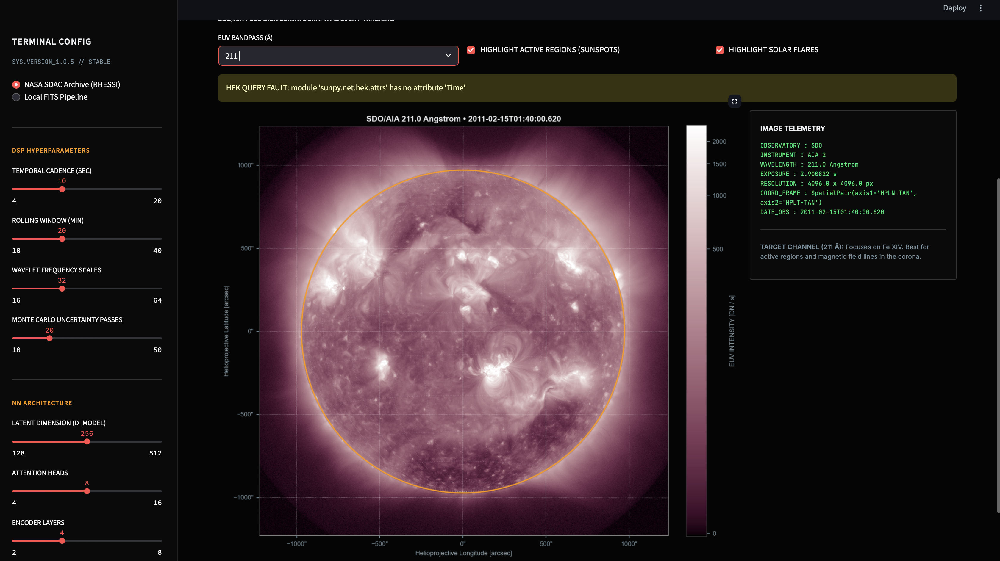

<p align="center">
  
</p>

<h1 align="center">
SunFLAAR
</h1>

<p align="center">
Open-source Python package for AI-powered Solar Flare Analysis
</p>

<p align="center">

[](https://pypi.org/project/sunflaar/)
[]()
[]()
[]()
[]()

</p>

<p align="center">
  
  
  
</p>

# SunFLAAR

SunFLAAR is a comprehensive Python package for solar observation visualization, data processing, and deep-learning-based solar flare forecasting. 

## Package Structure

SunFLAAR is organized into modular interfaces for visualization, forecasting, data processing, and research workflows. 

| Module | Import | Description |
|:-------|:-------|:------------|
| **SunVis** | `from sunflaar import sunvis` | Live full-disk solar observations from SDO/AIA, GOES, and Helioviewer with multi-wavelength visualization. |
| **Predict** | `from sunflaar import predict` | Deep-learning solar flare forecasting using pretrained SunFLAAR models on live or historical observations. |
| **Data** | `from sunflaar import data` | Download, preprocess, clean, and synchronize solar observations from supported archives. |
| **Plotting** | `from sunflaar import plotting` | Publication-quality scientific visualizations, diagnostic dashboards, and statistical plots. |
| **Model** | `from sunflaar import model` | Neural network architectures and utilities for research and inference. |
| **CLI** | `from sunflaar import cli` | Command-line interface for prediction, visualization, and workflow automation. |
| **REST API**| `from sunflaar import app` | HTTP interface for integrating SunFLAAR into external applications and dashboards. |

---

## SunVis

The **SunVis** module provides a professional interface for exploring the Sun in real time using multiple observational instruments.

### Features
* Live SDO/AIA observations
* Multi-wavelength imaging
* GOES X-ray flux overlay
* Active region identification
* Limb and heliographic grid rendering
* Historical observation retrieval
* Interactive zoom and region inspection
* Publication-quality visualization

### Supported Wavelengths

| Channel | Instrument | Science Target |
|:--------|:-----------|:---------------|
| **94 Å** | SDO/AIA | Hot flare plasma |
| **131 Å** | SDO/AIA | Flare cores |
| **171 Å** | SDO/AIA | Quiet corona |
| **193 Å** | SDO/AIA | Active corona |
| **211 Å** | SDO/AIA | Active regions |
| **304 Å** | SDO/AIA | Chromosphere |
| **335 Å** | SDO/AIA | High-temperature corona |

### Examples

You can quickly launch a live viewer using the functional API:

```python
from sunflaar import sunvis

# Launch a live view
sunvis.live()

# Or view a specific historical date and wavelength
sunvis.show(
    wavelength=171,
    date="2026-08-07T12:30"
)
